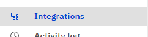
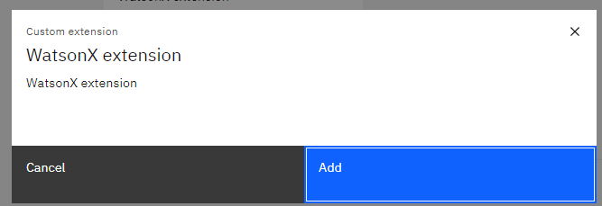
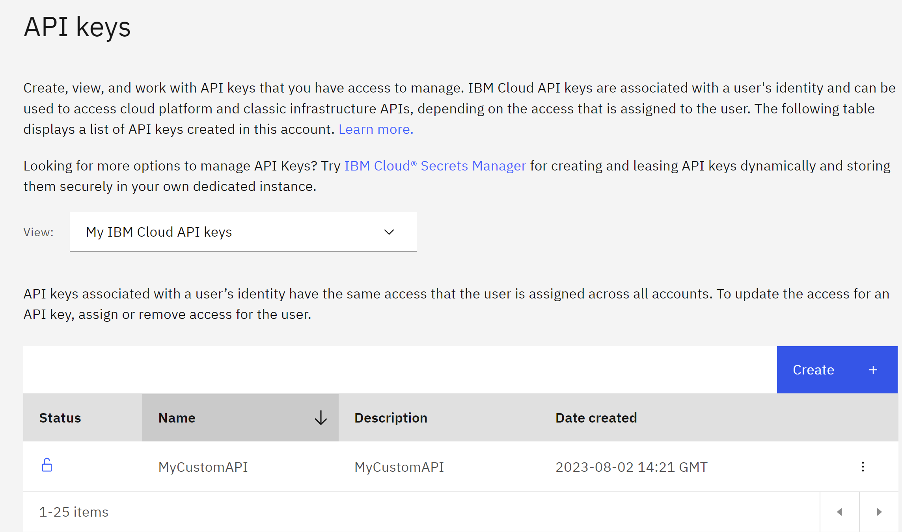
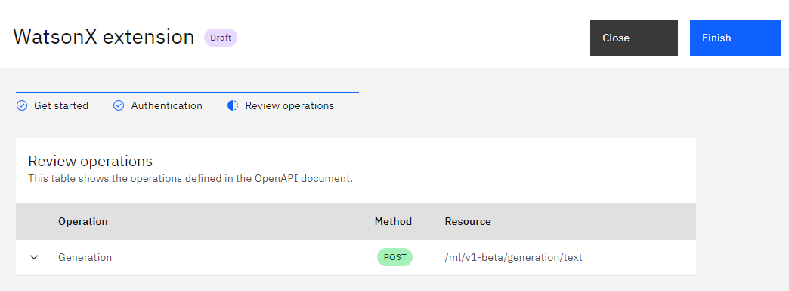
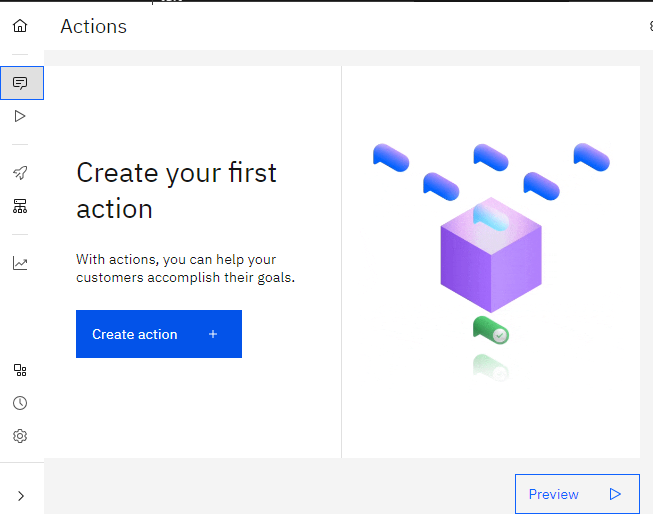
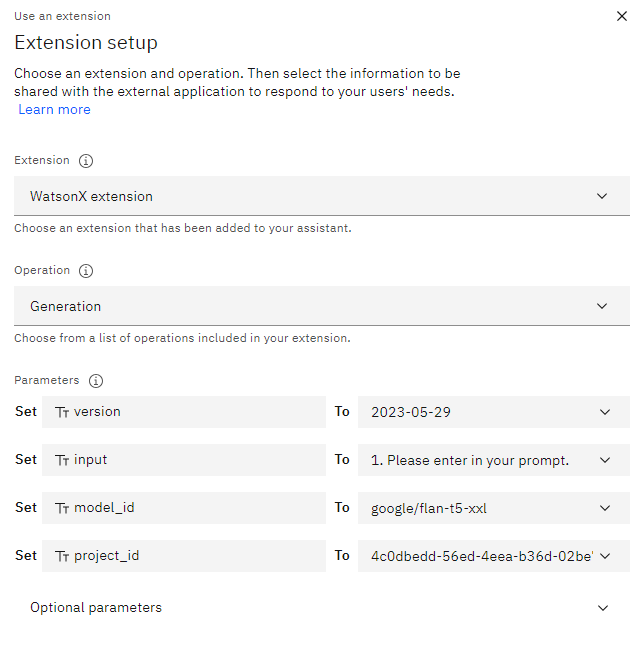
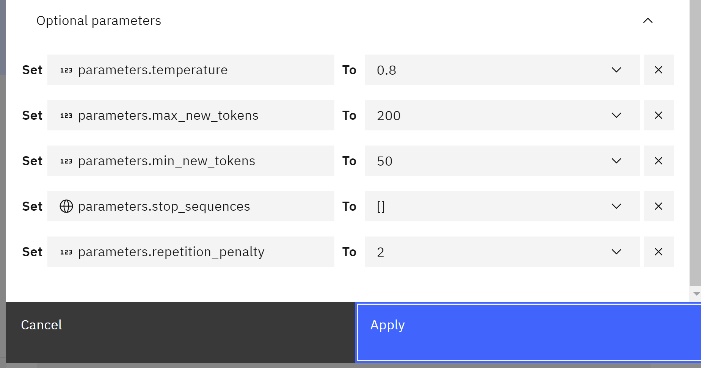
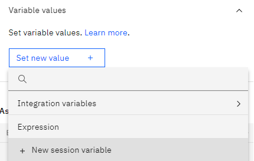
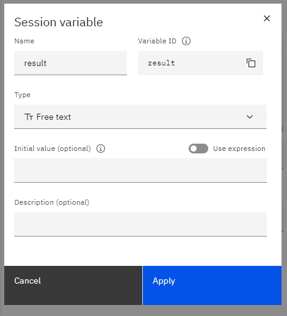

There are different ways to integrate WatsonX with Watson Assistant.

Method 1

First we need to download the following json file
https://github.com/watson-developer-cloud/assistant-toolkit/blob/master/integrations/extensions/starter-kits/language-model-watsonx/watsonx-openapi.json


Then we need to create our Watson Assistant.

Then we go to Integrations



Then we go to Extensions and click Build custom extension

We click next and then we can name like WatsonX extension then next and we attach our wasonx openapi.json


then we have to add the WatsonX extension to Watson Assistant by click in Add

you click Add


During the setup of this extesion, you requiere to get the API of the WatsonX.

To get his, first you need to go to your WatsonX account

Then you can open the Experiment with the foundation models with Prompt Lab
Let us choose an simple example like Marketing Generation


then under the view code we click  create personal API key


then we create our API key

then we copy it and we paste inour WatsonX extension

then we save and finish

We return back to our Watson Assistant
and we can create an action

for example Marketing Generation

We create the first step, we can say

```
Please enter in your prompt
```
and then we define a custemer response like Free text


then we create an extra step, the step we name

```
Call watson extension
```
and then we continue to next step by using an extension


In ordering to setup the extension you requiere to go back to your WatsonX and see the code

in my example  will have something like

```
curl "https://us-south.ml.cloud.ibm.com/ml/v1-beta/generation/text?version=2023-05-29" \
  -H 'Content-Type: application/json' \
  -H 'Accept: application/json' \
  -H 'Authorization: Bearer YOUR_ACCESS_TOKEN' \
  -d $'{
  "model_id": "google/flan-t5-xxl",
  "input": "Generate a 5 sentence marketing message for a company with the given characteristics.\\n\\nDetails\\nCharacteristics:\\n\\nCompany - Golden Bank\\n\\nOffer includes - no fees, 2% interest rate, no minimum balance\\n\\nTone - informative\\n\\nResponse requested - click the link\\n\\nEnd date - July 15\\n\\nEmail\\n",
  "parameters": {
    "decoding_method": "sample",
    "max_new_tokens": 200,
    "min_new_tokens": 50,
    "random_seed": 111,
    "stop_sequences": [],
    "temperature": 0.8,
    "top_k": 50,
    "top_p": 1,
    "repetition_penalty": 2
  },
  "project_id": "4asdasdds-56ed-4eea-b36d"
}'
```
we will use the previous information to setup our extension in Watson Assistant

- For the version you will use a text with `2023-05-29`
- For input you will choose Action Step Variables and then you choose the first step `1.Please enter in your promt`
  
  
- For model_id `google/flan-t5-xxl`
  
- for project_id  you paste your project id for example `4asdasdds-56ed-4eea-b36d`
you will have something like


then for this example we will requiere additional options


then cliak apply.
Then we create a new step, with conditions, we choose `WatsonX extension(step2)` 

then `Ran successfully `

in order to express code we set variable values, and we create a `New session variable`

we name `result` and will be `free text`  and then apply.


then we click set variable values and then expression 


 

then we type in the value of the variable
`${result}=$`

and search action step variables

and select `1.Please enter in your propmt.`
then you add an space then ` + " "$` and find `WatsonX extension(step2)` 

then click on `Body.results`


and you are going to have something like this


due to you get an array, you add the following `[0]["generated_text"]`
that together in my case in something like this

```
${result} =${step_244} +" \\nOutput: \\n"+${step_370_result_1.body.results}[0]["generated_text"]
```
`


then in the assitant says you add a function `result`

and finally we click on preview


then type 

```
Marketing Generation
```
`
then

```
Generate 5 sentence marketing message for a company with the given characteristics. Details Characteristics: Company - Golden Bank Offer includes - no fees, 2% interest rate, no minimum balance Tone - informative Response requested - click the link End date - July 15 Email

```

additionally you can analize the output in the Extension inspector, to debug and analize the results.


